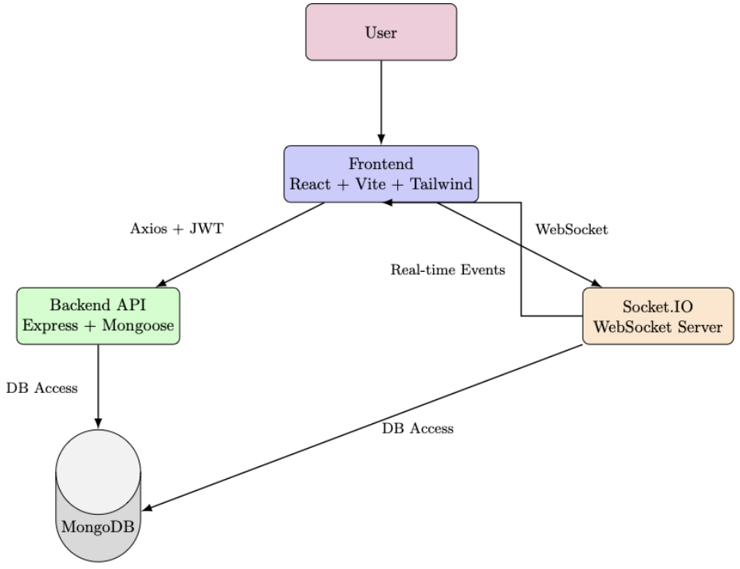

# AcadX – Academic Exchange Platform

**AcadX** addresses the lack of a reliable, structured way for students to exchange academic resources. It enables peer-to-peer sharing, real-time communication, and trusted interactions within a secure academic network.

## User Manual & Demo Video

Access the **user manual** and **video demo** here:  
🔗 [AcadX – User Manual & Demo Folder (Google Drive)](https://drive.google.com/drive/folders/1bYeyxT7bHV0NqcUm2QCQUl3_hw6-hjZ6?usp=drive_link)

## Table of Contents

1. [Features](#features)  
2. [Tech Stack](#tech-stack)  
3. [System Architecture](#system-architecture)  
4. [Database Schema](#database-schema)  
5. [Installation](#installation)  
6. [Usage Workflow](#usage-workflow)  
7. [Future Improvements](#future-improvements)  
8. [Live Website](#live-website)  
## Features

- Domain-based sign up/login  
- Profile personalization with avatar and bio  
- Upload and share academic materials  
- Request and approve materials from peers  
- Rate received content and users  
- Real-time one-on-one chat using Socket.IO  
- Animated and responsive UI using TailwindCSS and Lottie  
- Role-based content visibility (e.g. course, year, branch)


## Tech Stack

**Client:** React, TailwindCSS, Lottie Animations

**Server:** Node.js, Express.js  

**Real-time Messaging:** Socket.IO  

**Database:** MongoDB  

**Authentication:** JWT, Email Domain Filtering  


## System Architecture


## Database Schema


## Installation

1. Clone the repo
```bash
  git clone https://github.com/varunbalaji167/AcadX
  cd AcadX
```

2. Set up environment variables
- In root of server
```bash
MONGO_URI=<your-mongodb-uri>
JWT_SECRET=<your-secret>
PORT:3000
```    
- In root of client
```bash
VITE_API_BASE_URL=http://localhost:3000/api/
VITE_API_SOCKET_URL=http://localhost:3000/
```

3. In split terminals
```bash
    cd server
    npm install
    nodemon server.js
```
```bash
    cd client
    npm install
    npm run dev
```

## Usage Workflow

### Students

- Sign up using institution email (domain restricted)  
- Complete profile with avatar and course details  
- Upload study materials or Request materials from peers  
- Chat in real-time with the requested peer
- Approve or reject requests  
- Rate the content and its sharer  
## Future Improvements

- Email notifications for request approvals  
- Multiple images support 
- Material versioning or updates  
- Group chat or discussion forums  
- Admin dashboard for analytics and moderation  
- AI-powered content suggestions
## Live Website

**Live URL**: [AcadX](https://acadx-ten.vercel.app/)